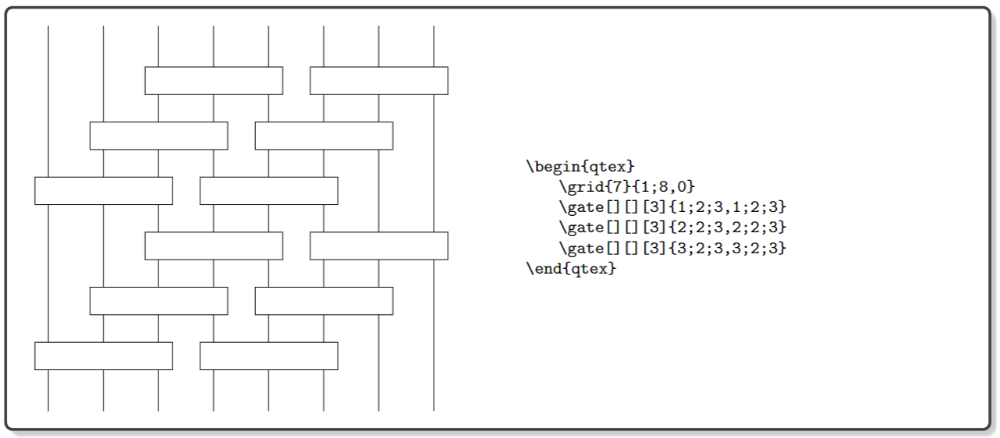

# QTeX: a LaTeX package for drawing quantum circuits

The main goal of this package is to provide a set of macros to draw quantum circuits using the simplest syntax
with enough flexibility. The package builds on the two very useful packages tikz and xparse. The micros are divided
into three classes, including circuit lines, gates and decorations. The package also provides an environment command
that should enclose all the micros for a given circuit diagram. The core feature is the gate drawing micros. These
commands have a for-loop built-in, which is convenient for many-body physicists. 

Most gate commands follow the same input syntax:
> \gatename[style][label][options]{xposition, yposition}

The xposition and yposition have the format:
> start;number;step

where start is the starting position, number is the number of repetitions and step controls distance between two consecutive repetitions. The parameters number and step are 1 by default and can be omitted.

## Gallary

The manual is working in progress. 
